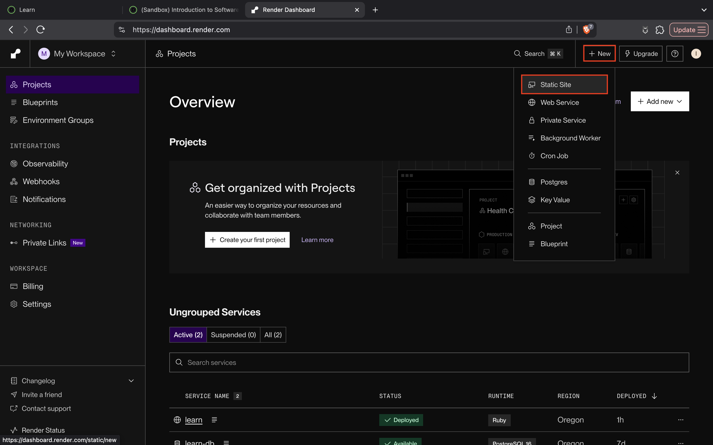
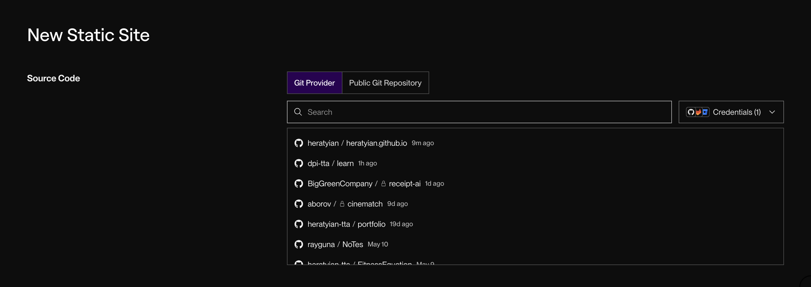
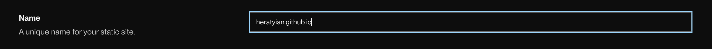
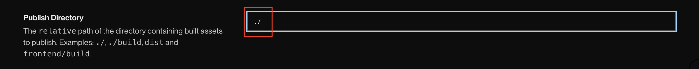
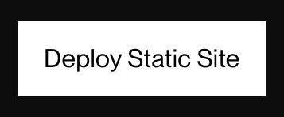
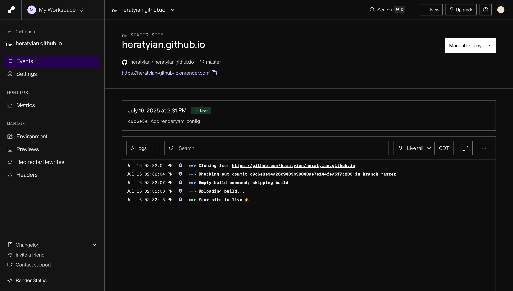
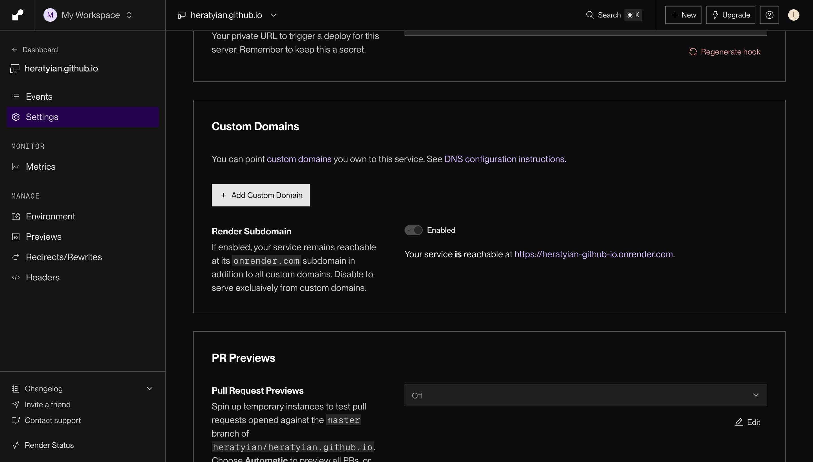

# Deploying a static web site on Render

Let's deploy our static portfolio page to cloud hosting platform [Render](https://render.com).

## Goals

In this lesson we'll use [Render](https://render.com) to deploy our portfolio website so it's available 24/7. By the end of this lesson your portfolio with be available at a url you can share with friends.

<!-- TODO: overview of "deploying" a website. on-prem vs cloud -->

## Sign Up For Render

Head over to [Render](https://render.com) and click "get started" to create an account.

## Create a New Static Site

Now click on '+ New' -> 'Static Site' to open the [New Static Site form](https://dashboard.render.com/static/new).

<!-- TODO: add brief on ftp, what happens when we connnect to github -->

You'll need to connect your GitHub account to render so they can access your repository.

Now set the name of your static site. This name will be used to create your url. Something like `app-name.onrender.com`.

Now we need to tell render where to find our code. Since we put our `index.html` file in the project root, we'll enter `./`.

<aside class="tip">
In UNIX systems, <code>.<code> is used to represent the current directory (or folder). <code>/</code> is used to represent a folder. Together, <code>./</code> means all files in the current directory (folder).
</aside>

With everything configured we're ready to deploy. Click "Deploy Static Site".

## Deploy

Once Render starts to deploy your site, you can monitor it's progress in the events tab.

You'll notice that Render "clones" (or copies) your code from GitHub then uploads it to the server. Static websites are pretty simple. Since this is connected to your GitHub repo, anytime you make a commit to 'main', Render will detect the change and start a new deploy automatically.

## Custom Domains

In the next lesson we'll dive into domains. If you'd like to purchase your own domain you can configure it in the settings tab.

